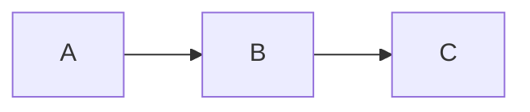

# Anti-patterns and cheat sheet

Covers: comprehensive list of common Markdown mistakes and how to fix them,
plus a complete syntax cheat sheet for quick reference.

---

## Anti-Patterns — Common Mistakes and Fixes

### Structure Anti-Patterns

| Anti-pattern | Why it's wrong | Fix |
|---|---|---|
| Multiple `# H1` headings | Only one H1 per doc (page title rule) | Use H2+ for all sections after the title |
| Skipping heading levels (H2 → H4) | Breaks logical hierarchy; accessibility issue | Follow strict H1 → H2 → H3 → H4 order |
| No introduction before first section | Reader has no context | Add 1–3 sentence overview before first H2 |
| `[TOC]` at top before introduction | Screen readers miss the introduction | Place `[TOC]` after introduction, before H2 |
| Generic headings: `### Summary` under multiple H2s | Anchor link collisions | Use unique, descriptive names: `### Foo Summary` |
| Giant monolithic document (1000+ lines) | Hard to navigate and maintain | Split into focused sub-documents with an index |
| No `## See Also` at the end | Reader has nowhere to go for related info | Add outbound links in a final `## See Also` section |

### Formatting Anti-Patterns

| Anti-pattern | Why it's wrong | Fix |
|---|---|---|
| Bolding entire paragraphs | Emphasis loses meaning | Bold key phrases only |
| Mixing `*` and `-` and `+` for bullets | Inconsistent; confusing in source | Pick one style (`-`) and use it throughout |
| Using `_underscores_` for bold/italic | Inconsistent parser behaviour mid-word | Always use `*asterisks*` and `**asterisks**` |
| Setext-style headings (`===`, `---`) | Ambiguous (is `---` an H2 or a rule?); fragile | Use ATX `##` style only |
| Trailing whitespace on lines | Hidden; unreliable line-break behaviour | Use `\` for intentional breaks; none otherwise |
| 4-space indented code blocks | Cannot declare a language; ambiguous start/end | Use fenced ` ``` ` blocks with language tags |
| Code block with no language declared | No syntax highlighting; reader/editor must guess | Always declare: ` ```python `, ` ```bash `, etc. |
| HTML tags for bold (`<b>`) and italic (`<i>`) | Reduces portability | Use `**` and `*` |
| Excessive horizontal rules between every section | Fragments the doc visually | Use headings to separate sections; use `---` sparingly |

### Link Anti-Patterns

| Anti-pattern | Why it's wrong | Fix |
|---|---|---|
| `[click here](url)` | Uninformative to scanners and screen readers | Write descriptive text: `[Installation guide](url)` |
| `[here](url)` or `[this link](url)` | Same as above | Wrap the most descriptive phrase in the sentence |
| Bare URL as link text: `[https://example.com](https://example.com)` | Wastes space; no meaningful label | Use `[Example Site](https://example.com)` |
| `../../../relative/path.md` | Breaks on file restructuring | Use root-relative paths: `/docs/path.md` |
| Full GitHub URL for an internal doc link | Breaks when repo is renamed/moved | Use root-relative path |
| Long URL inline in a table cell | Makes table unreadable | Use reference-style links |
| Reference links defined at bottom of long file (first use in section 2, definition in last section) | Hard to find source | Define reference links just before the next heading after first use |

### Image Anti-Patterns

| Anti-pattern | Why it's wrong | Fix |
|---|---|---|
| Empty or missing alt text on meaningful images | Inaccessible to screen readers | Write descriptive alt text: `` |
| ``, `` | Meaningless alt text | Describe what the image shows and why it matters |
| Storing all images in root directory | Clutters root; hard to manage | Use `images/` or `assets/images/` subdirectory |
| Non-descriptive image filenames: `img1.png`, `screen.png` | Hard to find; no context | Use descriptive names: `auth-flow-diagram.svg` |
| JPEG for screenshots | Lossy compression blurs text | Use PNG for screenshots |
| PNG for photographs | Unnecessarily large file | Use JPEG for photographic images |
| Relying solely on an image to convey content | Breaks for screen readers | Always accompany diagrams with prose or captioned explanation |

### Table Anti-Patterns

The Google style guide names three specific table problems to diagnose before writing:

| Named problem | Signs | Fix |
|---|---|---|
| **Poor distribution** | Columns don't differ across rows; cells are empty | The data doesn't need a table — use a list |
| **Unbalanced dimensions** | Very few rows vs. many columns (or vice versa) | Use a list with subheadings |
| **Rambling prose in cells** | Long sentences or paragraphs inside cells | Move prose out of the table |

General table anti-patterns:

| Anti-pattern | Why it's wrong | Fix |
|---|---|---|
| Table where a list would be clearer | Hard to maintain; verbose source | Use lists and subheadings |
| Mostly empty table cells | Data not appropriate for tabular form | Use lists or prose |
| Long URLs inline in table cells | Makes table source unreadable | Use reference links in table cells |
| Tables with a single column | Just use a list | Use `- item` list syntax |
| Prose paragraphs inside table cells | Markdown has no cell line-wrap | Move verbose content to a list or subsection |
| Inconsistent column alignment for numeric data | Hard to compare numbers | Right-align numeric columns with `---:` |

### HTML Anti-Patterns

| Anti-pattern | Why it's wrong | Fix |
|---|---|---|
| `<br>` for paragraph spacing | Not a paragraph break | Use a blank line |
| `<h2>`, `<h3>` instead of `##`, `###` | Breaks portability and TOC generation | Use ATX heading syntax |
| `<b>`, `<i>` instead of `**`, `*` | Reduces portability | Use Markdown emphasis |
| `<ul>`, `<ol>`, `<li>` for lists | Verbose; not Markdown | Use `-` and `1.` list syntax |
| CSS styling on individual elements | Renders in very few environments | Use structural Markdown only |
| HTML tables instead of pipe tables | Not necessary unless table is extremely complex | Use Markdown pipe-table syntax |

### File Management Anti-Patterns

| Anti-pattern | Why it's wrong | Fix |
|---|---|---|
| Spaces in filenames: `Getting Started.md` | Spaces break URLs | Use `getting-started.md` |
| Uppercase in non-standard files: `API_Reference.md` | URL path is case-sensitive; inconsistent | Use `api-reference.md` |
| All docs in the root directory | Clutters root; hard to navigate | Put docs in `docs/` subdirectory |
| No `README.md` in subdirectories | Reader has no entry point | Add an index `README.md` to each docs subdirectory |
| `CHANGELOG` without `.md` extension | May not render as Markdown on GitHub | Use `CHANGELOG.md` |
| Stale docs left indefinitely | Worse than no docs; misleads readers | Delete or archive stale content regularly |

---

## Complete Syntax Cheat Sheet

### Document Skeleton

```markdown
---
title: "Document Title"
date: "2024-01-15"
---

# Document Title

Short introduction (1–3 sentences).

[TOC]

## Section One

Content.

## Section Two

Content.

## See Also

- [Link one](https://example.com)
```

### Headings

```markdown
# H1 — one per document
## H2
### H3
#### H4
##### H5
###### H6
```

### Emphasis

```markdown
**bold**                  Strong importance
*italic*                  Stress emphasis
***bold italic***         Both
~~strikethrough~~         Deprecated / error
`inline code`             Code, commands, field names
```

### Lists

```markdown
- Unordered item          Use - consistently
- Another item
  - Nested (2-space indent)

1. Ordered item
2. Second item
1. Lazy numbering (also valid)

- [x] Completed task      GFM task list
- [ ] Pending task
```

### Code

````markdown
`inline code`

```python
# Fenced block — always declare language
def foo():
    pass
```
````

### Links

```markdown
[Link text](https://url.com)
[Link text](/root/relative/path.md)
[Link text](same-dir-file.md)
[Link text][ref-id]

[ref-id]: https://long-url.com
```

### Images

```markdown


[](https://link.com)   ← clickable image
```

### Tables

```markdown
| Left | Centre | Right |
|:-----|:------:|------:|
| Text |  Text  | 12.50 |
```

### Blockquotes and Callouts

```markdown
> Standard blockquote

> [!NOTE]       GFM alert
> [!TIP]
> [!IMPORTANT]
> [!WARNING]
> [!CAUTION]
```

### Horizontal Rule

```markdown
---
```

### Footnotes (extended)

```markdown
Body text.[^1]

[^1]: Footnote content.
```

### Math (extended)

```markdown
Inline: $E = mc^2$

Block:
$$
\frac{d}{dx} f(x) = f'(x)
$$
```

### Mermaid (extended)

````markdown

````

### Escaping

```markdown
\*  \#  \`  \_  \[  \]  \(  \)  \{  \}  \.  \!  \|
```

### HTML (last resort only)

```markdown
<br>                     Hard line break
<kbd>Ctrl</kbd>          Keyboard key
<sub>subscript</sub>     Subscript fallback
<sup>superscript</sup>   Superscript fallback
<details><summary>Title</summary>Body</details>   Collapsible
<!-- comment -->         Invisible author note
```

---

## Quick Review Checklist

Use this when reviewing or finalising any Markdown file:

**Structure**
- [ ] Exactly one `# H1` heading
- [ ] 1–3 sentence introduction before first section
- [ ] No skipped heading levels
- [ ] Heading names are unique and descriptive
- [ ] `[TOC]` placed after introduction (if used)
- [ ] `## See Also` at the end (if the doc has outbound links)

**Formatting**
- [ ] Asterisks used for emphasis (not underscores)
- [ ] No bolded entire paragraphs
- [ ] Blank line before and after every heading
- [ ] Blank line between list and surrounding paragraphs
- [ ] Consistent bullet style (`-` throughout)
- [ ] No trailing whitespace

**Code**
- [ ] All fenced code blocks have a language tag
- [ ] No 4-space indented code blocks
- [ ] Long commands use trailing `\` for line continuation

**Links**
- [ ] All link text is descriptive (no "click here" / "here")
- [ ] Internal links use root-relative paths (not full URLs)
- [ ] No `../` cross-directory relative paths
- [ ] Reference links defined near their first use

**Images**
- [ ] All meaningful images have descriptive alt text
- [ ] No `` or `` alt text
- [ ] Images stored in `images/` or `assets/` directory

**Tables**
- [ ] Tables only used where data is genuinely two-dimensional
- [ ] Table cells are short (reference links for URLs)
- [ ] Numeric columns right-aligned

**HTML**
- [ ] No unnecessary HTML tags
- [ ] No HTML used for styling or layout

**Files**
- [ ] File name is lowercase-hyphenated (except standard UPPERCASE files)
- [ ] No spaces in file names
- [ ] Standard files (README, CHANGELOG) in root directory
- [ ] Non-standard docs in `docs/` subdirectory
