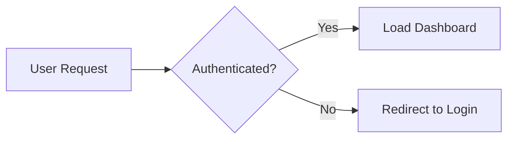
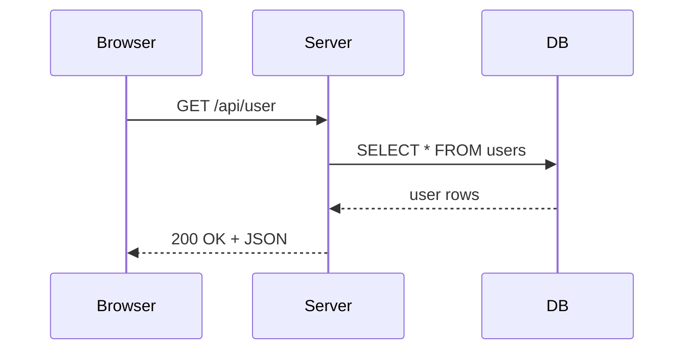
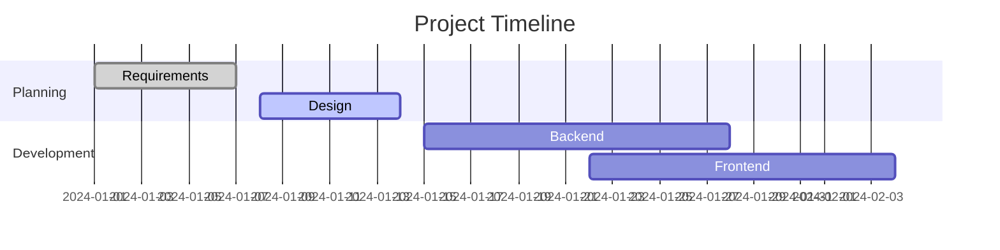
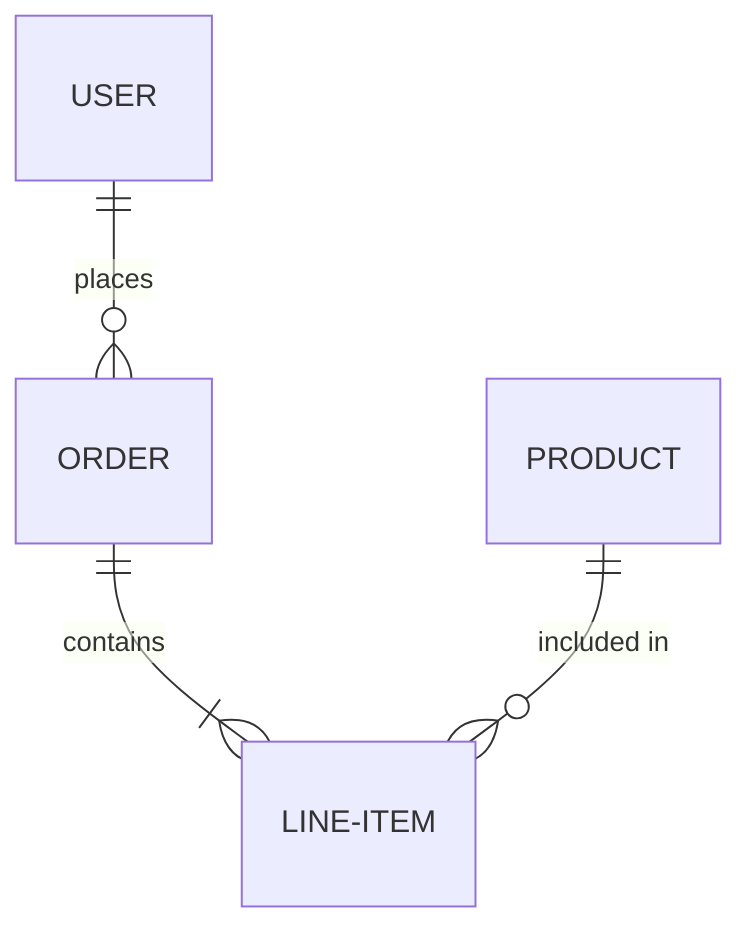

# Extended syntax and platform flavours

Covers: GitHub Flavored Markdown (GFM), GitLab Markdown, footnotes, task lists,
definition lists, heading IDs, emoji, highlight, math (LaTeX), Mermaid diagrams,
callout/alert blocks, automatic URLs, and platform compatibility notes.

**Primary sources:** [GFM Spec](https://github.github.com/gfm/),
[Markdown Guide — Extended Syntax](https://www.markdownguide.org/extended-syntax/),
[GitLab Flavored Markdown](https://docs.gitlab.com/user/markdown/)

> **Important:** Extended syntax is not universally supported. Always verify that
> your target platform supports a feature before using it. When in doubt, use basic
> syntax or an HTML fallback.

---

## GitHub Flavored Markdown (GFM)

GFM is the most widely used Markdown dialect. It extends CommonMark with:

| Feature | Syntax | Notes |
|---|---|---|
| Task lists | `- [x]` / `- [ ]` | Interactive checkboxes |
| Tables | Pipe syntax | Native table support |
| Strikethrough | `~~text~~` | Double tildes |
| Autolinks | Bare URLs | Auto-converted to links |
| Disallowed raw HTML | — | Some HTML tags are sanitised |
| Emoji shortcodes | `:emoji:` | `:rocket:` → 🚀 |
| Footnotes | `[^1]` | Supported in newer GFM |
| Math | `$` and `$$` | LaTeX, added 2022 |
| Mermaid diagrams | ` ```mermaid ` | Flowcharts, sequences, etc. |
| Alerts / callouts | `> [!NOTE]` | 5 types, added 2023 |
| Collapsed sections | `<details>` | HTML, but rendered by GitHub |

---

## GFM Alert Blocks (Callouts)

The most important GFM extension for documentation. Five alert types:

```markdown
> [!NOTE]
> Useful information the reader should know, even if skimming.

> [!TIP]
> Optional advice that helps the reader succeed.

> [!IMPORTANT]
> Key information necessary for the reader to succeed.

> [!WARNING]
> Urgent information; the reader must take care.

> [!CAUTION]
> Advises about risks or negative outcomes of an action.
```

GitHub renders each with a distinct coloured icon. Use these instead of plain
blockquotes whenever a semantic callout is needed.

---

## Footnotes

Footnotes add references and notes without cluttering body text. A superscript
link in the body jumps to the footnote definition at the bottom of the rendered page.

```markdown
Here is a claim that needs a citation.[^1]

This statement has a named footnote.[^note]

[^1]: The source for the first claim.
[^note]: Named footnotes still render with sequential numbers,
    but are easier to manage in source. Indent continuation lines
    with 4 spaces to include multiple paragraphs.

    Second paragraph of the footnote.
```

### Footnote Rules

- Identifiers can be numbers or words; no spaces or tabs.
- Identifiers are for source management only — output is always sequential numbers.
- Place footnote definitions at the end of the document or at the end of the section.
- Indent continuation lines with 4 spaces to include multi-paragraph footnotes.

---

## Heading IDs (Custom Anchors)

Override the auto-generated anchor for a heading:

```markdown
## My Long Section Title {#short-id}

Now link to it with:
[Go to short section](#short-id)
```

Useful when:
- The heading text is very long and produces an unwieldy anchor.
- You want to rename a heading without breaking existing deep links.
- You need stable anchor IDs that survive heading text changes.

**Support:** Pandoc, Kramdown (Jekyll), MkDocs, many static site generators.
Not supported in plain GitHub rendering.

---

## Task Lists

See `02-formatting-syntax.md` for full task list syntax. Additional notes:

- Task lists are **interactive** on GitHub (checkboxes are clickable in issues and PRs).
- In rendered documentation, they are read-only visual checkboxes.
- Nesting works:

  ```markdown
  - [ ] Parent task
    - [x] Completed sub-task
    - [ ] Pending sub-task
  ```

---

## Definition Lists

Supported by Pandoc, MkDocs (with extensions), Kramdown, and PHP Markdown Extra.
**Not supported** in standard GFM.

```markdown
First Term
:   Definition of the first term.

Second Term
:   First definition of the second term.
:   Second definition of the second term.

*Markdown Term*
:   Definition can contain **Markdown** formatting.
```

Rendered output:
> **First Term** — Definition of the first term.
> **Second Term** — First definition of the second term. / Second definition of the second term.

---

## Math (LaTeX / KaTeX)

Supported on GitHub (added 2022), GitLab, Jupyter, MkDocs with plugins, Pandoc.

### Inline Math

```markdown
The formula is $E = mc^2$ where $m$ is mass and $c$ is the speed of light.
```

### Block Math

```markdown
$$
\frac{d}{dx}\left( \int_{a}^{x} f(u)\,du\right)=f(x)
$$
```

```markdown
$$
\begin{pmatrix}
a & b \\
c & d
\end{pmatrix}
$$
```

---

## Mermaid Diagrams

Supported on GitHub, GitLab, Notion, Obsidian, and many static site generators
(MkDocs with `pymdownx.superfences`).

### Flowchart

````markdown

````

### Sequence Diagram

````markdown

````

### Gantt Chart

````markdown

````

### Entity Relationship Diagram

````markdown

````

---

## Emoji Shortcodes (GFM)

```markdown
:rocket: :white_check_mark: :warning: :x: :bulb: :books:
```

Renders as: 🚀 ✅ ⚠️ ❌ 💡 📚

Use emoji sparingly in technical documentation — they improve scannability for
status indicators but can appear unprofessional in formal docs. Never rely solely
on emoji to convey meaning (accessibility concern).

---

## Strikethrough

Standard GFM with double tildes:

```markdown
~~deleted text~~
```

**Do not** use single tildes (`~text~`) for strikethrough — single tildes are for
subscript in some parsers and strikethrough in others, causing inconsistent rendering.

---

## Automatic URL Linking

Most modern processors auto-link bare URLs:

```markdown
Visit https://example.com for more information.
```

To suppress auto-linking, wrap in backticks:

```markdown
`https://example.com/search?q=$TERM`
```

---

## Inline Diff (GitLab Only)

```markdown
{+addition+}
{-deletion-}
```

Renders with green/red highlighting in GitLab. Not supported elsewhere.

---

## Platform Compatibility Matrix

| Feature | CommonMark | GFM (GitHub) | GitLab | Pandoc | Kramdown | MkDocs |
|---|:---:|:---:|:---:|:---:|:---:|:---:|
| Tables | ❌ | ✅ | ✅ | ✅ | ✅ | ✅ |
| Task lists | ❌ | ✅ | ✅ | ✅ | ✅ | ✅* |
| Strikethrough | ❌ | ✅ | ✅ | ✅ | ✅ | ✅ |
| Footnotes | ❌ | ✅ | ✅ | ✅ | ✅ | ✅* |
| Definition lists | ❌ | ❌ | ✅ | ✅ | ✅ | ✅* |
| Math (LaTeX) | ❌ | ✅ | ✅ | ✅ | ✅* | ✅* |
| Mermaid | ❌ | ✅ | ✅ | ❌ | ❌ | ✅* |
| GFM Alerts | ❌ | ✅ | ❌ | ❌ | ❌ | ❌ |
| Custom heading IDs | ❌ | ❌ | ✅ | ✅ | ✅ | ✅ |
| Emoji shortcodes | ❌ | ✅ | ✅ | ✅* | ❌ | ✅* |
| Highlight (`==`) | ❌ | ❌ | ❌ | ✅* | ✅* | ✅* |
| Subscript (`~`) | ❌ | ❌ | ✅ | ✅* | ✅* | ✅* |
| Superscript (`^`) | ❌ | ❌ | ✅ | ✅* | ✅* | ✅* |

`*` = requires plugin/extension configuration

---

## Stack Overflow and Discord Notes

**Stack Overflow** does not support: tables (use HTML `<table>`), task lists, footnotes.
Supports: headings, emphasis, lists, links, images, code blocks, blockquotes, horizontal rules.

**Discord** supports: bold, italic, underline (`__text__`), strikethrough, inline code,
code blocks with syntax highlighting, blockquotes, spoiler tags (`||text||`), H1–H3.
Does not support: tables, images via Markdown, footnotes, task lists.
Note: Discord uses `__text__` for **underline**, not bold — conflicts with standard Markdown.

**Slack** uses its own "mrkdwn" format — significantly different from standard Markdown.
